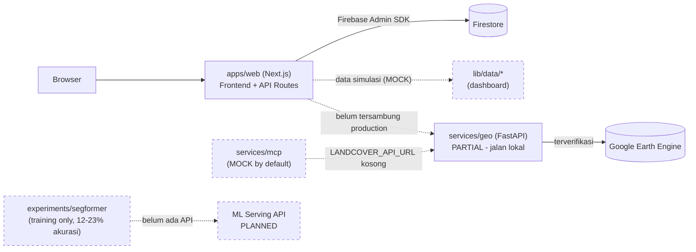

# EcoSentra — Platform Analisis Lahan dan Ekosistem Indonesia


[](https://github.com/PashaAkrilian/EcoSentra-Platform-Analisis-Lahan-dan-Ekosistem-Indonesia/actions/workflows/ci.yml)

EcoSentra adalah platform web untuk analisis tutupan lahan dan ekosistem di
Indonesia, memanfaatkan data satelit (Google Earth Engine) dan model machine
learning untuk klasifikasi tutupan lahan. Dokumen ini adalah **checkpoint
jujur**: menjelaskan apa yang benar-benar berfungsi sekarang, apa yang baru
sebagian, dan apa yang masih rencana — bukan daftar fitur ideal.

## Status Fitur

Label: **LIVE** (berfungsi & terverifikasi) · **PARTIAL** (kode ada, sebagian
berfungsi) · **MOCK** (kode ada, pakai data simulasi) · **PLANNED** (belum
dibangun).

| Fitur | Status | Catatan |
|---|---|---|
| Dashboard interaktif | 🧪 MOCK | Data dari `apps/web/lib/data/*.ts` (delay simulasi), belum tersambung Firestore asli |
| Peta interaktif (Leaflet, hotspot, label zoom-aware) | ✅ LIVE | Render nyata di `/maps`, termasuk fix label-clutter di zoom rendah |
| Backend API Firestore (10 route: `fields`, `alerts`, `users`, dst.) | ✅ LIVE | Validasi input (Zod) aktif; **tanpa autentikasi** — siapa pun bisa baca/tulis semua koleksi |
| Layanan analisis tutupan lahan by koordinat (`services/geo`) | 🟡 PARTIAL | Terverifikasi jalan lokal + Google Earth Engine asli (rate limiting aktif); **belum di-deploy**, belum tersambung ke frontend/MCP di production |
| MCP server (`services/mcp`, tool `get_land_cover`) | 🧪 MOCK | Default `LANDCOVER_API_URL` kosong → data simulasi; siap switch ke `services/geo` asli tinggal isi env var |
| Klasifikasi tutupan lahan berbasis ML (SegFormer) | 🟡 PARTIAL | Model sudah dilatih (baseline run-01), akurasi piksel **12–23%** (dekat tebakan acak untuk 9 kelas) — belum layak dipakai |
| Layanan serving model ML sebagai API | 📋 PLANNED | Belum ada kode sama sekali — sengaja ditunda sampai akurasi model layak |
| Keamanan dasar (validasi input, rate limiting, audit kredensial) | ✅ LIVE | Zod di 9 route, rate limit di `/api/landcover`, ringkasan di `docs/security-checklist.md` |
| CI/CD (GitHub Actions) | 🟡 PARTIAL | Pipeline lint/type-check/build sudah terpasang & benar secara konfigurasi; run saat ini merah karena secret Firebase belum diisi di GitHub |
| Testing otomatis (unit/integration) | 📋 PLANNED | Nol test suite — hanya ada 1 script manual (`services/geo/test_gee.py`) |
| Autentikasi/login user | 📋 PLANNED | Belum ada sama sekali — prioritas #1 roadmap keamanan |

## Arsitektur



Garis putus-putus = belum tersambung nyata / belum dibangun.

## Teknologi & Alasan Pemilihan

| Teknologi | Alasan Dipilih | Trade-off |
|---|---|---|
| Next.js 15 (App Router) | Satu framework untuk frontend + API routes ringan, cocok untuk MVP solo-developer | Backend & frontend campur dalam satu app — perlu disiplin folder (`server/` vs `lib/`) supaya kode server-only tidak ter-bundle ke client |
| TypeScript | Type safety untuk API routes & data layer | Tidak dipakai di layanan Python (`services/geo`, `services/mcp`) — batas antar bahasa lewat HTTP/MCP, tanpa shared types |
| Tailwind CSS + shadcn/ui (Radix) | Build UI cepat & konsisten tanpa CSS custom banyak | Template awal (v0.dev) membawa puluhan komponen tak terpakai — 41 file & 33 dependency baru dibersihkan, lihat `docs/cleanup-report.md` |
| Firebase (Firestore + Admin SDK) | Setup cepat untuk MVP, tanpa mengelola server database sendiri | Admin SDK di route API **bypass total** Firestore Security Rules — kontrol akses efektif ada di level API yang saat ini tanpa auth |
| FastAPI (`services/geo`) | Python adalah bahasa resmi SDK Google Earth Engine; FastAPI ringan & async | Menambah bahasa kedua di monorepo — perlu venv/Docker terpisah dari Node |
| MCP (Model Context Protocol) | Supaya layanan geo bisa dipanggil sebagai tool oleh AI assistant (LandAI/agent eksternal) | Standar masih baru, ekosistem tooling lebih terbatas dibanding REST biasa |
| SegFormer (HuggingFace, `segformer-b0`) | Model segmentasi semantik ringan untuk klasifikasi tutupan lahan dari citra | Butuh GPU untuk training layak; hasil run pertama (12-23% akurasi) menunjukkan effort training belum cukup |
| Zod | Validasi skema ringan di sisi TypeScript, minim boilerplate | Skema saat ini generik (bukan per-collection) — belum menangkap semua kesalahan tipe data spesifik |
| slowapi | Rate limiting in-memory sederhana untuk FastAPI | Tidak scale ke multi-instance/deployment horizontal — perlu Redis kalau traffic nyata |
| GitHub Actions | CI terintegrasi langsung dengan GitHub, tanpa infra tambahan | Belum ada test otomatis untuk dijalankan — pipeline baru sebatas lint/type-check/build |

## Cara Menjalankan Secara Lokal

### `apps/web` — Frontend + Backend API

```bash
cd apps/web
npm install
cp .env.local.example .env.local   # isi kredensial Firebase asli
npm run dev
```

Wajib diisi di `.env.local` supaya API routes tidak error saat start:
`FIREBASE_PROJECT_ID`, `FIREBASE_CLIENT_EMAIL`, `FIREBASE_PRIVATE_KEY`
(Firebase Console → Project Settings → **Service accounts** → Generate new
private key).

### `services/geo` — Layanan Analisis Tutupan Lahan (GEE)

```bash
cd services/geo
python -m venv .venv && source .venv/bin/activate
pip install -r requirements.txt
cp .env.example .env   # isi GEE_SERVICE_ACCOUNT, GEE_KEY_PATH
uvicorn app.main:app --reload --port 8001
```

Wajib punya service account Google Earth Engine (file JSON) — tanpa ini,
layanan tidak bisa terhubung ke GEE sama sekali.

### `services/mcp` — MCP Server

```bash
cd services/mcp
python -m venv .venv && source .venv/bin/activate
pip install -r requirements.txt
python server.py
```

Langsung jalan dalam mode **MOCK** tanpa konfigurasi tambahan. Untuk mode
nyata, set `LANDCOVER_API_URL=http://localhost:8001` (mengarah ke
`services/geo` yang sudah jalan di atas).

### `services/ml` — Eksperimen Model

Belum ada API untuk dijalankan. Baca
[`experiments/segformer-openearthmap/run-01-baseline/RUN_INFO.md`](./experiments/segformer-openearthmap/run-01-baseline/RUN_INFO.md)
untuk hasil eksperimen training terkini.

## Struktur Folder Monorepo

```
.
├── apps/
│   └── web/              # Next.js — frontend + API routes (Firestore)
├── services/
│   ├── geo/               # FastAPI — analisis tutupan lahan via Google Earth Engine
│   ├── mcp/                # MCP server — tool get_land_cover (mock/real switchable)
│   └── ml/                 # Placeholder — belum ada kode serving
├── experiments/
│   └── segformer-openearthmap/  # Eksperimen training model klasifikasi tutupan lahan
├── docs/                  # Dokumentasi turunan (lihat di bawah)
└── .github/workflows/     # CI (lint, type-check, build)
```

## Roadmap Singkat

Urutan pengerjaan selanjutnya, berdasarkan status nyata di atas:

1. **Retraining model SegFormer** — epoch lebih banyak, sampai akurasi jauh di atas 12-23%.
2. **Bangun layanan serving ML** (FastAPI wrapping model) — setelah akurasi layak.
3. **Sambungkan MCP & dashboard ke layanan asli** — ganti `services/geo`/data layer dari mock ke real.
4. **Deploy `services/geo`** — saat ini cuma terverifikasi jalan lokal.
5. **Sistem autentikasi/login** — prioritas keamanan tertinggi, saat ini nol proteksi di semua 10 route yang menyentuh Firestore.
6. **Test suite otomatis** (unit + integration) — nol test saat ini.
7. **Lengkapi GitHub Actions Secrets** supaya pipeline CI hijau.

## Dokumentasi Lain

- [`docs/git-workflow.md`](./docs/git-workflow.md) — strategi branching (GitLab Flow)
- [`docs/security-checklist.md`](./docs/security-checklist.md) — hasil audit keamanan fondasi
- [`docs/api-contracts.md`](./docs/api-contracts.md) — kontrak endpoint dashboard (mock → real)
- [`docs/ci-cd.md`](./docs/ci-cd.md) — penjelasan pipeline CI & cara menambah job baru
- [`docs/cleanup-report.md`](./docs/cleanup-report.md) — laporan pembersihan file/dependency tidak terpakai

## Lisensi

Proyek ini dilisensikan di bawah [MIT License](./License.txt).

Hak Cipta © 2025 tim EcoSentra – Ketua: PashaAkrilian
